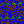
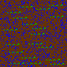

# day 20

https://adventofcode.com/2020/day/20

The task is to assemble an image from different 10x10 tiles. The tiles themselves can be flipped and rotated.

## transformations

I didn't want to calculate the image transformations myself, so I used java's `java.awt.geom.AffineTransform`.
I created a 4x4 testimage with 16 different shades of red to calculate a hash of the overall image to check, which transformation yield the same result.

all 18 possible transformations

- Clockwise180
- Clockwise180,FlipHorizontal
- Clockwise180,FlipVertical
- Clockwise270
- Clockwise270,FlipHorizontal
- Clockwise270,FlipVertical
- Clockwise90
- Clockwise90,FlipHorizontal
- Clockwise90,FlipVertical
- FlipHorizontal
- FlipHorizontal,Clockwise180
- FlipHorizontal,Clockwise270
- FlipHorizontal,Clockwise90
- FlipVertical
- FlipVertical,Clockwise180
- FlipVertical,Clockwise270
- FlipVertical,Clockwise90
- NoOp

### examples of different transformations yielding the same image

| image                                                                                                                                                                                                    | transformations            | hash                                     |
| -------------------------------------------------------------------------------------------------------------------------------------------------------------------------------------------------------- | -------------------------- | ---------------------------------------- |
|                      | NoOp                       | 0153045607590105120135150165180195210225 |
|  | Clockwise270, FlipVertical | 0601201801575135195309015021045105165225 |
|   | FlipVertical, Clockwise90  | 0601201801575135195309015021045105165225 |
|  | Clockwise180, FlipVertical | 1801952102251201351501656075901050153045 |
|            | FlipHorizontal             | 1801952102251201351501656075901050153045 |

### There are only 8 distinct transformations

| image                                                                                                                                                                                                   | transformations           | hash                                     |
| ------------------------------------------------------------------------------------------------------------------------------------------------------------------------------------------------------- | ------------------------- | ---------------------------------------- |
|                     | NoOp                      | 0153045607590105120135150165180195210225 |
|              | Clockwise90               | 4510516522530901502101575135195060120180 |
|             | Clockwise180              | 2252101951801651501351201059075604530150 |
|             | Clockwise270              | 1801206001951357515210150903022516510545 |
|  | Clockwise90, FlipVertical | 2251651054521015090301951357515180120600 |
|           | FlipHorizontal            | 1801952102251201351501656075901050153045 |
|             | FlipVertical              | 4530150105907560165150135120225210195180 |
|  | FlipVertical, Clockwise90 | 0601201801575135195309015021045105165225 |

## image transformations

take this tile from the example input

```text
Tile 1951:
#.##...##.
#.####...#
.....#..##
#...######
.##.#....#
.###.#####
###.##.##.
.###....#.
..#.#..#.#
#...##.#..
```

### tiles as images

| image                                                                                                                                        | transformations | image                                                                                                                                                   | transformations           |
| -------------------------------------------------------------------------------------------------------------------------------------------- | --------------- | ------------------------------------------------------------------------------------------------------------------------------------------------------- | ------------------------- |
|          | NoOp            |  | Clockwise90, FlipVertical |
|   | Clockwise90     |           | FlipHorizontal            |
|  | Clockwise180    |             | FlipVertical              |
|  | Clockwise270    |  | FlipVertical, Clockwise90 |

## calculating edges

To find the matching edges I decided to encode the edges of each tile (and its transformed representations) as hashes.
For that we take the top, left, bottom and right pixels and convert them into binary representation.

```text
#.##...##. -->
1011000110 = 710
```

So the top edge of tile 1951 from above is represented as 710.

## matching edges

To find a matching pair the directions of the matches matter.

### match-direction: vertical

```text
id1 (top)
id2 (bottom)
```

### match-direction: horizontal

```text
id1 (left) | id2 (right)
```

### matching tiles

This are all the matching edges.

| tile1 id | transformation tile1      | tile2 id | transformation tile2      | match direction | hash of matching edge |
| -------- | ------------------------- | -------- | ------------------------- | --------------- | --------------------- |
| 1171     | NoOp                      | 1489     | Clockwise180              | horizontal      | 288                   |
| 1171     | FlipVertical              | 1489     | FlipHorizontal            | horizontal      | 18                    |
| 1171     | Clockwise90               | 1489     | Clockwise270              | vertical        | 391                   |
| 1171     | FlipVertical, Clockwise90 | 1489     | Clockwise90, FlipVertical | vertical        | 902                   |
| 1171     | Clockwise90               | 2473     | NoOp                      | horizontal      | 966                   |
| 1171     | Clockwise90, FlipVertical | 2473     | FlipVertical              | horizontal      | 399                   |
| 1171     | Clockwise180              | 2473     | Clockwise90               | vertical        | 96                    |
| 1171     | FlipVertical              | 2473     | FlipVertical, Clockwise90 | vertical        | 24                    |
| 1427     | Clockwise90               | 1489     | Clockwise90               | horizontal      | 948                   |
| 1427     | Clockwise90, FlipVertical | 1489     | Clockwise90, FlipVertical | horizontal      | 183                   |
| 1427     | Clockwise180              | 1489     | Clockwise180              | vertical        | 300                   |
| 1427     | FlipVertical              | 1489     | FlipVertical              | vertical        | 210                   |
| 1427     | FlipVertical, Clockwise90 | 2311     | FlipVertical, Clockwise90 | horizontal      | 210                   |
| 1427     | Clockwise270              | 2311     | Clockwise270              | horizontal      | 300                   |
| 1427     | FlipHorizontal            | 2311     | FlipHorizontal            | vertical        | 183                   |
| 1427     | NoOp                      | 2311     | NoOp                      | vertical        | 948                   |
| 1427     | NoOp                      | 2473     | Clockwise90               | horizontal      | 234                   |
| 1427     | FlipVertical              | 2473     | Clockwise90, FlipVertical | horizontal      | 348                   |
| 1427     | Clockwise90               | 2473     | Clockwise180              | vertical        | 9                     |
| 1427     | FlipVertical, Clockwise90 | 2473     | FlipVertical              | vertical        | 576                   |
| 1427     | FlipHorizontal            | 2729     | FlipHorizontal            | horizontal      | 576                   |
| 1427     | Clockwise180              | 2729     | Clockwise180              | horizontal      | 9                     |
| 1427     | Clockwise90, FlipVertical | 2729     | Clockwise90, FlipVertical | vertical        | 348                   |
| 1427     | Clockwise270              | 2729     | Clockwise270              | vertical        | 234                   |
| 1489     | NoOp                      | 1171     | Clockwise180              | horizontal      | 18                    |
| 1489     | FlipVertical              | 1171     | FlipHorizontal            | horizontal      | 288                   |
| 1489     | Clockwise90               | 1171     | Clockwise270              | vertical        | 689                   |
| 1489     | FlipVertical, Clockwise90 | 1171     | Clockwise90, FlipVertical | vertical        | 565                   |
| 1489     | FlipVertical, Clockwise90 | 1427     | FlipVertical, Clockwise90 | horizontal      | 948                   |
| 1489     | Clockwise270              | 1427     | Clockwise270              | horizontal      | 183                   |
| 1489     | FlipHorizontal            | 1427     | FlipHorizontal            | vertical        | 43                    |
| 1489     | NoOp                      | 1427     | NoOp                      | vertical        | 848                   |
| 1489     | FlipHorizontal            | 2971     | FlipHorizontal            | horizontal      | 565                   |
| 1489     | Clockwise180              | 2971     | Clockwise180              | horizontal      | 689                   |
| 1489     | Clockwise90, FlipVertical | 2971     | Clockwise90, FlipVertical | vertical        | 288                   |
| 1489     | Clockwise270              | 2971     | Clockwise270              | vertical        | 18                    |
| 1951     | NoOp                      | 2311     | NoOp                      | horizontal      | 498                   |
| 1951     | FlipVertical              | 2311     | FlipVertical              | horizontal      | 318                   |
| 1951     | Clockwise90               | 2311     | Clockwise90               | vertical        | 587                   |
| 1951     | FlipVertical, Clockwise90 | 2311     | FlipVertical, Clockwise90 | vertical        | 841                   |
| 1951     | Clockwise90               | 2729     | Clockwise90               | horizontal      | 710                   |
| 1951     | Clockwise90, FlipVertical | 2729     | Clockwise90, FlipVertical | horizontal      | 397                   |
| 1951     | Clockwise180              | 2729     | Clockwise180              | vertical        | 177                   |
| 1951     | FlipVertical              | 2729     | FlipVertical              | vertical        | 564                   |
| 2311     | Clockwise90               | 1427     | Clockwise90               | horizontal      | 210                   |
| 2311     | Clockwise90, FlipVertical | 1427     | Clockwise90, FlipVertical | horizontal      | 300                   |
| 2311     | Clockwise180              | 1427     | Clockwise180              | vertical        | 924                   |
| 2311     | FlipVertical              | 1427     | FlipVertical              | vertical        | 231                   |
| 2311     | FlipHorizontal            | 1951     | FlipHorizontal            | horizontal      | 498                   |
| 2311     | Clockwise180              | 1951     | Clockwise180              | horizontal      | 318                   |
| 2311     | Clockwise90, FlipVertical | 1951     | Clockwise90, FlipVertical | vertical        | 616                   |
| 2311     | Clockwise270              | 1951     | Clockwise270              | vertical        | 89                    |
| 2311     | NoOp                      | 3079     | FlipVertical              | horizontal      | 89                    |
| 2311     | FlipVertical              | 3079     | NoOp                      | horizontal      | 616                   |
| 2311     | Clockwise90               | 3079     | FlipVertical, Clockwise90 | vertical        | 318                   |
| 2311     | FlipVertical, Clockwise90 | 3079     | Clockwise90               | vertical        | 498                   |
| 2473     | FlipHorizontal            | 1171     | FlipVertical, Clockwise90 | horizontal      | 966                   |
| 2473     | Clockwise180              | 1171     | Clockwise270              | horizontal      | 399                   |
| 2473     | Clockwise90, FlipVertical | 1171     | FlipHorizontal            | vertical        | 184                   |
| 2473     | Clockwise270              | 1171     | NoOp                      | vertical        | 116                   |
| 2473     | FlipVertical, Clockwise90 | 1427     | FlipHorizontal            | horizontal      | 234                   |
| 2473     | Clockwise270              | 1427     | Clockwise180              | horizontal      | 348                   |
| 2473     | FlipHorizontal            | 1427     | Clockwise90, FlipVertical | vertical        | 481                   |
| 2473     | NoOp                      | 1427     | Clockwise270              | vertical        | 542                   |
| 2473     | NoOp                      | 3079     | Clockwise90, FlipVertical | horizontal      | 116                   |
| 2473     | FlipVertical              | 3079     | Clockwise90               | horizontal      | 184                   |
| 2473     | Clockwise90               | 3079     | FlipVertical              | vertical        | 399                   |
| 2473     | FlipVertical, Clockwise90 | 3079     | Clockwise180              | vertical        | 966                   |
| 2729     | NoOp                      | 1427     | NoOp                      | horizontal      | 576                   |
| 2729     | FlipVertical              | 1427     | FlipVertical              | horizontal      | 9                     |
| 2729     | Clockwise90               | 1427     | Clockwise90               | vertical        | 962                   |
| 2729     | FlipVertical, Clockwise90 | 1427     | FlipVertical, Clockwise90 | vertical        | 271                   |
| 2729     | FlipVertical, Clockwise90 | 1951     | FlipVertical, Clockwise90 | horizontal      | 710                   |
| 2729     | Clockwise270              | 1951     | Clockwise270              | horizontal      | 397                   |
| 2729     | FlipHorizontal            | 1951     | FlipHorizontal            | vertical        | 680                   |
| 2729     | NoOp                      | 1951     | NoOp                      | vertical        | 85                    |
| 2729     | Clockwise90               | 2971     | Clockwise90               | horizontal      | 85                    |
| 2729     | Clockwise90, FlipVertical | 2971     | Clockwise90, FlipVertical | horizontal      | 680                   |
| 2729     | Clockwise180              | 2971     | Clockwise180              | vertical        | 397                   |
| 2729     | FlipVertical              | 2971     | FlipVertical              | vertical        | 710                   |
| 2971     | NoOp                      | 1489     | NoOp                      | horizontal      | 565                   |
| 2971     | FlipVertical              | 1489     | FlipVertical              | horizontal      | 689                   |
| 2971     | Clockwise90               | 1489     | Clockwise90               | vertical        | 78                    |
| 2971     | FlipVertical, Clockwise90 | 1489     | FlipVertical, Clockwise90 | vertical        | 456                   |
| 2971     | FlipVertical, Clockwise90 | 2729     | FlipVertical, Clockwise90 | horizontal      | 85                    |
| 2971     | Clockwise270              | 2729     | Clockwise270              | horizontal      | 680                   |
| 2971     | FlipHorizontal            | 2729     | FlipHorizontal            | vertical        | 532                   |
| 2971     | NoOp                      | 2729     | NoOp                      | vertical        | 161                   |
| 3079     | FlipHorizontal            | 2311     | Clockwise180              | horizontal      | 616                   |
| 3079     | Clockwise180              | 2311     | FlipHorizontal            | horizontal      | 89                    |
| 3079     | Clockwise90, FlipVertical | 2311     | Clockwise270              | vertical        | 66                    |
| 3079     | Clockwise270              | 2311     | Clockwise90, FlipVertical | vertical        | 264                   |
| 3079     | FlipVertical, Clockwise90 | 2473     | Clockwise180              | horizontal      | 184                   |
| 3079     | Clockwise270              | 2473     | FlipHorizontal            | horizontal      | 116                   |
| 3079     | FlipHorizontal            | 2473     | Clockwise270              | vertical        | 501                   |
| 3079     | NoOp                      | 2473     | Clockwise90, FlipVertical | vertical        | 702                   |

## finding the corner pieces

If you count the number of matching tiles for each tile, you can determine their place in the picture.

The tiles with only two matching tiles must be the corners of the picture. Thankfully, Erik designed the puzzle in a way that this property holds.

| tile id | number of matches | matching tiles      |
| ------- | ----------------- | ------------------- |
| 1171    | 2                 | 1489,2473           |
| 1427    | 4                 | 1489,2311,2473,2729 |
| 1489    | 3                 | 1171,1427,2971      |
| 1951    | 2                 | 2311,2729           |
| 2311    | 3                 | 1427,1951,3079      |
| 2473    | 3                 | 1171,1427,3079      |
| 2729    | 3                 | 1427,1951,2971      |
| 2971    | 2                 | 1489,2729           |
| 3079    | 2                 | 2311,2473           |

So, our corners are these tiles.

| tile id | matching tiles |
| ------- | -------------- |
| 1171    | 1489,2473      |
| 1951    | 2311,2729      |
| 2971    | 1489,2729      |
| 3079    | 2311,2473      |

## assembling the picture

Assembling the picture turns out to be quite complex. First, we have to pick one of the four corner pieces and assume, this is our top-left tile.

Let's pick the aforementioned corner-tile 1951 as our top-left cornerpiece.

We now have to figure out how to transform it in a way, such that the matching edges are on the inside - or, we flip it around and look for the edges that face outwards.

### finding the outer edges

| tile ids   | number of tiles with that edge | edge hash |
| ---------- | ------------------------------ | --------- |
| ...        | ...                            | ...       |
| 1427, 1489 | 2                              | 948       |
| **1951**   | **1**                          | **177**   |
| **1951**   | **1**                          | **564**   |
| **1951**   | **1**                          | **587**   |
| **1951**   | **1**                          | **841**   |
| 1951, 2311 | 2                              | 318       |
| 1951, 2729 | 2                              | 397       |
| 1951, 2311 | 2                              | 498       |
| 1951, 2729 | 2                              | 710       |
| 2311       | 1                              | 231       |
| ...        | ...                            | ...       |

We now have to pick those transformations where the top _and_ left edge have one of those hashes (177, 564, 587, 841)

#### finding correct transformations of 1951 to make it a cornerpiece with the correct edges facing outwards

Here are the edge-configurations of every possible transformation of tile 1951.

| transformation            | top     | left    | bottom  | right   |
| ------------------------- | ------- | ------- | ------- | ------- |
| Clockwise180              | 177     | 318     | 397     | 587     |
| Clockwise90, FlipVertical | 318     | 177     | 587     | 397     |
| FlipHorizontal            | 397     | 498     | 177     | 841     |
| Clockwise270              | 498     | 397     | 841     | 177     |
| **FlipVertical**          | **564** | **587** | **710** | **318** |
| **Clockwise90**           | **587** | **564** | **318** | **710** |
| NoOp                      | 710     | 841     | 564     | 498     |
| FlipVertical, Clockwise90 | 841     | 710     | 498     | 564     |

We now know, that there are only two valid transformations of tile 1951: FlipVertical and Clockwise90.

With this information we can orient the neighbors of 1951 properly.

#### orienting the neighbors

We know from above that 1951 only has two possible neighbors.

| tile id | matching tiles |
| ------- | -------------- |
| 1951    | 2311,2729      |

Let's expand that relationship further.

| tile1 id | transformation tile1 | tile2 id | transformation tile2 | match direction | hash of matching edge |
| -------: | -------------------- | -------- | -------------------- | --------------- | --------------------: |
|     1951 | FlipVertical         | 2311     | FlipVertical         | horizontal      |                   318 |
|     1951 | FlipVertical         | 2729     | FlipVertical         | vertical        |                   564 |
|     1951 | Clockwise90          | 2729     | Clockwise90          | horizontal      |                   710 |
|     1951 | Clockwise90          | 2311     | Clockwise90          | vertical        |                   587 |

We have two possibilities to arange these pieces

| y\x | 0                                                                                                                                                                         | 1                                                                                                                                                                    |
| --- | ------------------------------------------------------------------------------------------------------------------------------------------------------------------------- | -------------------------------------------------------------------------------------------------------------------------------------------------------------------- |
| 0   | 1951 FlipVertical <br>       | 2311 FlipVertical <br>  |
| 1   |  <br> 2729 FlipVertical <br> |                                                                                                                                                                      |

| y\x | 0                                                                                                                                                                       | 1                                                                                                                                                                  |
| --- | ----------------------------------------------------------------------------------------------------------------------------------------------------------------------- | ------------------------------------------------------------------------------------------------------------------------------------------------------------------ |
| 0   | 1951 Clockwise90 <br>       | 2729 Clockwise90 <br>  |
| 1   |  <br> 2311 Clockwise90 <br> |                                                                                                                                                                    |

#### more constraints

We know that the piece at (1,0) has to have its top edge outwards-facing.

| tile ids | number of tiles with that edge | edge hash |
| -------- | ------------------------------ | --------- |
| 2311     | 1                              | 231       |
| 2311     | 1                              | 924       |
| 2729     | 1                              | 271       |
| 2729     | 1                              | 962       |

Here are the tile-configurations of 2311 and 2729 after applying the possible transformations (FlipVertical and Clockwise90)

| id   | transformation | top     | left    | bottom | right |
| ---- | -------------- | ------- | ------- | ------ | ----- |
| 2311 | FlipVertical   | **231** | 318     | 210    | 616   |
| 2311 | Clockwise90    | 318     | **231** | 616    | 210   |
| 2729 | FlipVertical   | 710     | **962** | 85     | 9     |
| 2729 | Clockwise90    | **962** | 710     | 9      | 85    |

Let's examine 2311:

- if we put 2311 at (1,0) we have to apply FlipVertical. The the top edge has to be facing outwards, which it does (hash 231).
- if we put 2311 at (0,1) we have to apply Clockwise90. The the left edge has to be facing outwards, which it does (hash 231).

Let's examine 2729:

- if we put 2729 at (1,0) we have to apply Clockwise90. The the top edge has to be facing outwards, which it does (hash 962).
- if we put 2729 at (0,1) we have to apply FlipVertical. The the left edge has to be facing outwards, which it does (hash 962).

This doesn't help us either, since these configurations are still valid.

#### finding tiles with two neighbors

We want to place the tile (1,1). It has to satisfy the following condition

```scala
   tile(1,1).top  == tile(1,0).bottom
&& tile(1,1).left == tile(0,1).right
```

| id   | transformation | x   | y   | top | left | bottom | right |
| ---- | -------------- | --- | --- | --- | ---- | ------ | ----- |
| 2311 | FlipVertical   | 1   | 0   | 231 | 318  | 210    | 616   |
| 2729 | FlipVertical   | 0   | 1   | 710 | 962  | 85     | 9     |
| 2729 | Clockwise90    | 1   | 0   | 962 | 710  | 9      | 85    |
| 2311 | Clockwise90    | 0   | 1   | 318 | 231  | 616    | 210   |

This means we're looking for a tile t where

```text
t.top == 210 && t.left == 9 ||
t.top == 9   && t.left == 210
```

| id   | transformation | top | left | bottom | right |
| ---- | -------------- | --- | ---- | ------ | ----- |
| 1427 | Clockwise90    | 9   | 210  | 348    | 948   |
| 1427 | FlipVertical   | 210 | 9    | 948    | 348   |

We have still have two possibilities to arange these pieces.

| y\x | 0                                                                                                                                                                         | 1                                                                                                                                                                         |
| --- | ------------------------------------------------------------------------------------------------------------------------------------------------------------------------- | ------------------------------------------------------------------------------------------------------------------------------------------------------------------------- |
| 0   | 1951 FlipVertical <br>       | 2311 FlipVertical <br>       |
| 1   |  <br> 2729 FlipVertical <br> |  <br> 1427 FlipVertical <br> |

| y\x | 0                                                                                                                                                                       | 1                                                                                                                                                                       |
| --- | ----------------------------------------------------------------------------------------------------------------------------------------------------------------------- | ----------------------------------------------------------------------------------------------------------------------------------------------------------------------- |
| 0   | 1951 Clockwise90 <br>       | 2729 Clockwise90 <br>       |
| 1   |  <br> 2311 Clockwise90 <br> |  <br> 1427 Clockwise90 <br> |

#### finding the top right corner piece

We can now look for the top right corner piece with one added constraint. Its left edge has to match the right edge of (1,0). The transformation has to orient the tile in a way that the top and right faces point outwards.

| id   | transformation | top | left | bottom | right |
| ---- | -------------- | --- | ---- | ------ | ----- |
| 2971 | Clockwise90    | 78  | 85   | 689    | 161   |
| 3079 | NoOp           | 702 | 616  | 184    | 264   |

Still two possibilities to arrange our tiles.

| y\x | 0                                                                                                                                                                         | 1                                                                                                                                                                         | 2                                                                                                                                                    |
| --- | ------------------------------------------------------------------------------------------------------------------------------------------------------------------------- | ------------------------------------------------------------------------------------------------------------------------------------------------------------------------- | ---------------------------------------------------------------------------------------------------------------------------------------------------- |
| 0   | 1951 FlipVertical <br>       | 2311 FlipVertical <br>       | 3079 NoOp <br>  |
| 1   |  <br> 2729 FlipVertical <br> |  <br> 2729 FlipVertical <br> |                                                                                                                                                      |

| y\x | 0                                                                                                                                                                       | 1                                                                                                                                                                       | 2                                                                                                                                                                  |
| --- | ----------------------------------------------------------------------------------------------------------------------------------------------------------------------- | ----------------------------------------------------------------------------------------------------------------------------------------------------------------------- | ------------------------------------------------------------------------------------------------------------------------------------------------------------------ |
| 0   | 1951 Clockwise90 <br>       | 2729 Clockwise90 <br>       | 2971 Clockwise90 <br>  |
| 1   |  <br> 2311 Clockwise90 <br> |  <br> 1427 Clockwise90 <br> |                                                                                                                                                                    |

#### finding the bottom left corner piece

We can now look for the bottom left corner piece with one added constraint. Its top edge has to match the bottom edge of (0,1). The transformation has to orient the tile in a way that the bottom and left faces point outwards.

| id   | transformation            | top | left | bottom | right |
| ---- | ------------------------- | --- | ---- | ------ | ----- |
| 2971 | FlipVertical              | 85  | 78   | 161    | 689   |
| 3079 | FlipVertical, Clockwise90 | 616 | 702  | 264    | 184   |

| y\x | 0                                                                                                                                                                    | 1                                                                                                                                                                    |
| --- | -------------------------------------------------------------------------------------------------------------------------------------------------------------------- | -------------------------------------------------------------------------------------------------------------------------------------------------------------------- |
| 0   | 1951 FlipVertical <br>  | 2311 FlipVertical <br>  |
| 1   |                         |                         |
| 2   |                         |                                                                                                                                                                      |

| y\x | 0                                                                                                                                                                  | 1                                                                                                                                                                  |
| --- | ------------------------------------------------------------------------------------------------------------------------------------------------------------------ | ------------------------------------------------------------------------------------------------------------------------------------------------------------------ |
| 0   | 1951 Clockwise90 <br>  | 2729 Clockwise90 <br>  |
| 1   |                        |                        |
| 2   |            |                                                                                                                                                                    |

### mirrored symmetry

We see that it's going to continue to find two possibilities, since the whole thing can be mirrored. For completing the example we just pick the first configuration.
For that we place 2971 at (2,0) and 3079 at (0,2).

| y\x | 0                 | 1                 | 2         |
| --- | ----------------- | ----------------- | --------- |
| 0   | 1951 FlipVertical | 2311 FlipVertical | 3079 NoOp |
| 1   | 2729 FlipVertical | 1427 FlipVertical |           |
| 2   | 2971 FlipVertical |                   |           |

| y\x | 0                                                                                                                                             | 1                                                                                                                                             | 2                                                                                                                                     |
| --- | --------------------------------------------------------------------------------------------------------------------------------------------- | --------------------------------------------------------------------------------------------------------------------------------------------- | ------------------------------------------------------------------------------------------------------------------------------------- |
| 0   |  |  |  |
| 1   |  |  |                                                                                                                                       |
| 2   |  |                                                                                                                                               |                                                                                                                                       |

### continue to fill the missing pieces

#### (1,2)

| id   | transformation | top | left | bottom | right |
| ---- | -------------- | --- | ---- | ------ | ----- |
| 1489 | FlipVertical   | 948 | 689  | 848    | 288   |

| y\x | 0                                                                                                                                             | 1                                                                                                                                             | 2                                                                                                                                     |
| --- | --------------------------------------------------------------------------------------------------------------------------------------------- | --------------------------------------------------------------------------------------------------------------------------------------------- | ------------------------------------------------------------------------------------------------------------------------------------- |
| 0   |  |  |  |
| 1   |  |  |                                                                                                                                       |
| 2   |  |  |                                                                                                                                       |

#### (2,1)

| id   | transformation            | top | left | bottom | right |
| ---- | ------------------------- | --- | ---- | ------ | ----- |
| 2473 | Clockwise90, FlipVertical | 184 | 348  | 399    | 481   |

| y\x | 0                                                                                                                                             | 1                                                                                                                                             | 2                                                                                                                                                        |
| --- | --------------------------------------------------------------------------------------------------------------------------------------------- | --------------------------------------------------------------------------------------------------------------------------------------------- | -------------------------------------------------------------------------------------------------------------------------------------------------------- |
| 0   |  |  |                     |
| 1   |  |  |  |
| 2   |  |  |                                                                                                                                                          |

#### (2,2)

Yay - our last cornerpiece

| id   | transformation | top | left | bottom | right |
| ---- | -------------- | --- | ---- | ------ | ----- |
| 1171 | FlipHorizontal | 399 | 288  | 96     | 902   |

### the last piece

| y\x | 0                                                                                                                                             | 1                                                                                                                                             | 2                                                                                                                                                        |
| --- | --------------------------------------------------------------------------------------------------------------------------------------------- | --------------------------------------------------------------------------------------------------------------------------------------------- | -------------------------------------------------------------------------------------------------------------------------------------------------------- |
| 0   |  |  |                     |
| 1   |  |  |  |
| 2   |  |  |           |

### generalizing the rules

- pick one of the cornerpieces for (0,0) and orient it
  - top and left edges must face outwards
  - if there are more than one possible transformation, pick one of them

```scala
  val filterFn: ((Int, Edge, List[Transformation], BufferedImage)) => Boolean = { row =>
    (useTopTileFilter, useLeftTileFilter) match {
      case (true, true)   => topTileFilter(row) && leftTileFilter(row)
      case (true, false)  => topTileFilter(row) && leftOuterFilter(row)
      case (false, true)  => leftTileFilter(row) && topOuterFilter(row)
      case (false, false) => topOuterFilter(row) && leftOuterFilter(row)
    }
  }

```

## finding Nessi

### the final assembly

| assembled image <br> with borders                                                                                                            | assembled image <br> with highlighted border                                                                                                     | final version <br> with borders removed                                                                                                        |
| -------------------------------------------------------------------------------------------------------------------------------------------- | ------------------------------------------------------------------------------------------------------------------------------------------------ | ---------------------------------------------------------------------------------------------------------------------------------------------- |
|  |  |  |

<!-- with borders -->
<!-- (10) * 3 = 30 -->

<!-- with red grid -->
<!-- 1 + (10 + 1) * 3 = 34 -->

<!-- without borders -->
<!-- (10 -2) * 3 = 24 -->

### nessi

We have to find this pattern in the final image, but (of course) we don't know how the image has been transformed.

```text
                  #
#    ##    ##    ###
 #  #  #  #  #  #
```


We transform the image in all 8 ways and search for the pattern in each image.

| transformations         | image                                                                                                                                                              |
| ----------------------- | ------------------------------------------------------------------------------------------------------------------------------------------------------------------ |
| NoOp                    |                     |
| Clockwise90             |              |
| Clockwise180            |             |
| Clockwise270            |             |
| FlipHorizontal          |           |
| FlipVertical            |             |
| FlipVerticalClockwise90 |  |
| Clockwise90FlipVertical |  |

## The final image


We need to count the number of water-pixels that are not occupied by a sea monster.
I don't know if the sea monsters would overlap, so I selected all sea-monster pixels and diffed it with all water-pixels.



| sea-monster sightings | sea-monster pixels | water pixels | diff             |
| --------------------- | ------------------ | ------------ | ---------------- |
| 2                     | 30                 | 303          | 273 (our answer) |

## Solution for part 2

The solution for the random seed of my user looked like this



| sea-monster sightings | sea-monster pixels | water pixels | diff              |
| --------------------- | ------------------ | ------------ | ----------------- |
| 19                    | 285                | 1914         | 1629 (our answer) |

Turned out there were no overlapping sea monsters ;-)

Great fun, but quite complex to solve. I could have done it a lot simpler, but I enjoyed the programming with graphics.
